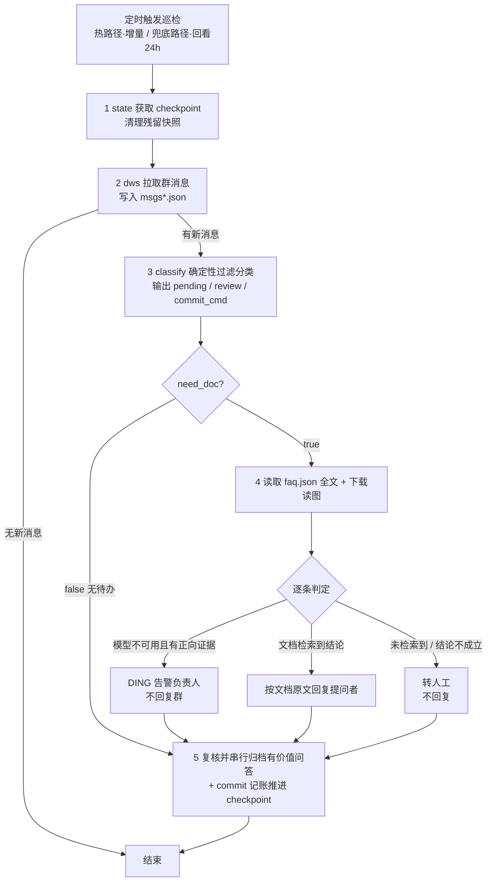

- [x] 给agent加入阅读图片的功能 ✅ 2026-08-31
- [x] 不要用关键词匹配 ✅ 2026-08-31

# 红区大模型支持群 · 自动值守 Agent 技术介绍

  

## 1. 功能定位

  

面向钉钉技术支持群落的**自动值守机器人**：按计划巡检群消息，对技术问题在团队 FAQ 文档中检索答案——**检索到对应结论则回复提问者，未检索到则保持静默**；同时将支持同学产出、有复用价值的问答归档回文档，持续扩充知识库、提升答复命中率。

  

- 检测到模型服务故障且证据充分时，不回复提问者，改为向负责人发送 DING 告警

- 文档未覆盖或语义无法判定的问题转人工跟进，保证答复均有文档依据

  

## 2. 所需配置

  

静态配置集中在 `redzone_config.json`，部署时需填写以下关键项：

  

| 配置项 | 键 | 用途 |

| --- | --- | --- |

| 钉钉群 ID | `group.open_conversation_id` | 拉取群消息、回复、下载图片所用的会话标识 |

| FAQ 文档地址 | `doc.url` | 知识源文档位置 |

| 文档授权 profile | `profiles.doc` | dws 读写该文档所需的数据授权标识 |

| 告警接收人 | `manager.name` + `manager.open_dingtalk_id` | 模型故障 DING 告警的接收负责人 |

| 支持同学名单 | `support_staff` | 名单内成员发言不当作提问，其答复可配对归档 |

| 回复时间窗 | `windows.reply_lookback_hours` | 默认仅处理 12h 内的消息 |

| 宽限期 | `windows.reply_grace_minutes` | 5 分钟内新消息不进待办，避免抢答 |

| FAQ 小节索引 | `faq_sections` | 归档配对与不可回复小节判定依据 |

  

回复时 @ 提问者所需的用户 ID 无需静态配置——取自群消息自带的 `senderOpenDingTalkId`，classify 生成 `reply_cmd` 模板时自动填充；需要静态指定的只有告警接收人（负责人）与巡检目标群。

  

## 3. 整体流程

  

  

## 4. 两条巡检路径

  

| | 热路径 | 兜底路径 |

| --- | --- | --- |

| 频率 | 高（分钟级） | 低（小时/日级） |

| 窗口 | checkpoint 以来的增量 | 固定回看 24h |

| 文档快照 | 优先复用缓存 | 每轮强制重拉最新 |

| 定位 | 及时回复 | 补漏：已有人工答复的旧消息不再回复，并收录未归档的人工问答 |

  

## 5. 主要工作

  

**1. 巡检 Prompt 的精简**

  

巡检指令收敛为固定 5 步，只保留可执行约束：dws 数据授权（data-auth）不在巡检开始时预执行，仅在实际调用报权限错误时按需触发一次并重试；无依赖的步骤（拉取文档快照、下载图片、多条回复）在同一轮并行发起，减少推理轮次；第 2 步拉取消息为空时立即短路结束，输出"本轮无新增待办"，不进入后续任何步骤——空转轮次只消耗一轮工具调用。

  

**2. 调度流程重构，以确定性程序减少与大模型的交互**

  

消息拉取、去重判定、时间窗过滤、归档配对、命令生成等机器可确定的逻辑全部下沉至确定性脚本（`redzone_support_agent2.py`，仅用标准库）：classify 一次性输出 `need_doc`、`pending`（各带 `reply_cmd` / `ding_cmd` / `download_cmd` 模板）、`review`（带归档 cmd）与 `commit_cmd` 等完整可执行命令。大模型无需自行拼装 dws 参数，只保留读文档判题、拟答正文、复核归档三项语义职责，工具往返与出错面大幅缩小。

  

**3. 自动归档优化**

  

将「支持同学以引用形式答复 + 答复够实质 + 尚未入档」的问答自动配对为归档候选（待整理队列），巡检轮末尾统一复核：有复用价值的在轮末串行 append 进知识库文档（同一文档并发写会互相覆盖，故强制串行）；事件通报、"我看看""私发我"等不成结论的候选直接剔除不写。归档成功才推进 archived 去重表，并配合 FAQ 快照二次校验，防止重复入库。

  

**4. 单轮巡检耗时优化**

  

多项措施综合生效：消息为空短路结束、无依赖步骤并行执行、`need_doc` 开关将文档全文阅读限制在确有问题的轮次、确定性脚本替代大模型反复拼装与往返，单轮巡检耗时由约 10 分钟降至 2-3 分钟。

  

**5. 问题全在截图里的纯图片消息**

  

classify 为图片消息的 pending 项附带 `download_cmd`，通过 `dws chat message download-media` 将原图下载至本地 `images/` 目录，Agent 再直接 Read 图片文件，原图以多模态输入直接交给大模型阅读。若因扩展名不符导致 Read 失败，先以 `file` 命令识别真实格式，再 `mv` 修正扩展名后重试；仍失败才判定为无法辨认而不回复。

  

**6. @ 提问者并回复**

  

dws 回复命令参数繁杂（`--at-open-dingtalk-ids`、`--uuid`、@ 占位符），由 Agent 自行拼装易出错。解决方案：脚本保存并生成 `reply_cmd` 模板，@ 占位符置于正文最前、参数全部预填，Agent 仅需将 `<在此填入回复正文>` 替换为整理自文档原文的完整结论。同时约定正文禁用单引号（命令以单引号包裹，会破坏配对），如需引号改用中文引号。

  

**7. 模型报错时的 DING 告警**

  

DING 钉钉平台是直接推送给负责人的强打扰通知，可以进行重要特殊情况的提醒，仅用于重要模型（平台核心服务）不可用这类高影响问题；告警需同时满足两个条件：① 明确表达模型/接口/平台不可用；② 报错与上下文无其他原因指向（用户侧环境、配置用法、额度权限等）。

  

**8. 关键词打分的整体移除**

  

早期方案以关键词打分（match_faq / keyword_weight）判题，但用户表述高度多样——"启动不了"无法匹配词表中的"起不来""打不开"；调低阈值又顾此失彼、扩大误判。最终整体移除该层：脚本不再判题，仅执行机器可确定的过滤（时间窗、support_staff 名单、机器人自发消息、去重表、宽限期、已被引用答复过）；其余消息一律进入 pending，由上层大模型阅读 FAQ 文档全文进行语义匹配。同时增加 `need_doc` 开关避免空转轮次无效读取全文：pending 为空则不读文档。