```mermaid
graph LR
    A[opencode 插件<br/>客户端] -->|POST /alert/issue/report<br/>上报问题| B[app-notifier<br/>Flask 后端服务]

    B -->|保存 JSON 文件| C[(文件系统<br/>/data/issue-reports/)]
    B -->|写入 MySQL| D[(issue_report 表)]
    B -->|发送钉钉消息<br/>含详情链接| E[钉钉问题上报群]

    E -->|用户点击链接| F[前端应用<br/>https://tone-dev.eng.t-head.cn<br/>页面路由 /app/issue-reports/&#123;id&#125;]

    F -->|调用 API 获取数据<br/>GET /alert/issue/&#123;id&#125;| B

    A -->|1. 用户在插件中<br/>触发问题上报| A
```

整个流程：

1. **opencode 插件**（客户端）遇到问题时，向 app-notifier 发送 `POST /alert/issue/report`，包含 id、description、timestamp 等数据
2. **app-notifier** 收到后做三件事：保存 JSON 文件、写入 MySQL、发钉钉消息（消息里附带详情链接）
3. **钉钉群**里的人看到通知，点击详情链接，跳转到**前端应用**的页面 `/app/issue-reports/{id}`
4. **前端应用**再调用 app-notifier 的 API `GET /alert/issue/{id}` 拿数据，展示详情

关键点：前端应用和 app-notifier 是**两个独立的东西**——前端提供网页页面，app-notifier 只提供 API。所以 app-notifier 无法自动知道前端的域名，只能在 config.py 里写默认值。